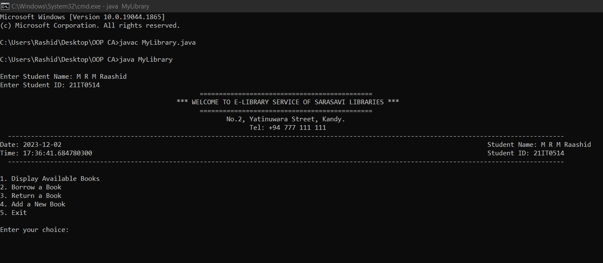

# E-Library Management System

## Overview
The **E-Library Management System** is a Java-based console application designed to simplify the management of a library. It offers a range of functionalities for library members, including the ability to display available books, borrow and return books, and add new books. This project provides an interactive user interface for easy library operations.



## Features
- **Display Available Books**: View all available books categorized by genre (Adventure, Classics, Crime, Fantasy, Horror).
- **Borrow a Book**: Borrow a book by entering its ISBN and category.
- **Return a Book**: Return a previously borrowed book by providing the ISBN and category.
- **Add a New Book**: Add new books to the library collection under specified categories.
- **User Interaction**: Custom messages and warnings for borrowing and returning books.
- **Transaction History**: Track actions performed, with logs for borrowing, returning, and adding books.

## Project Structure
- **Book Class**: Represents a book with details such as title, author, ISBN, and availability status.
- **Library Class**: Manages a collection of books categorized by genre and handles operations like borrowing and returning books.
- **User Class**: Represents a library user and keeps track of their borrowed books.
- **MyLibrary Class**: Main program that facilitates user interaction, displays menus, and handles user input.

## Usage
1. Run the program.
2. Enter the student name and ID to start interacting with the library.
3. Select options from the menu:
   - View available books.
   - Borrow a book by entering the ISBN and category.
   - Return a book by entering the ISBN and category.
   - Add a new book to the library.
4. Exit the program to see a summary of actions performed.

## Library Categories
- **Adventure**
- **Classics**
- **Crime**
- **Fantasy**
- **Horror**

## How to Run
1. Compile the Java code using:
   ```bash
   javac MyLibrary.java

2. Run the program with:
   ```bash
   java MyLibrary
